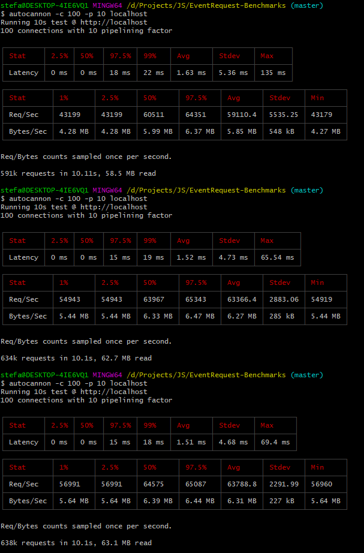
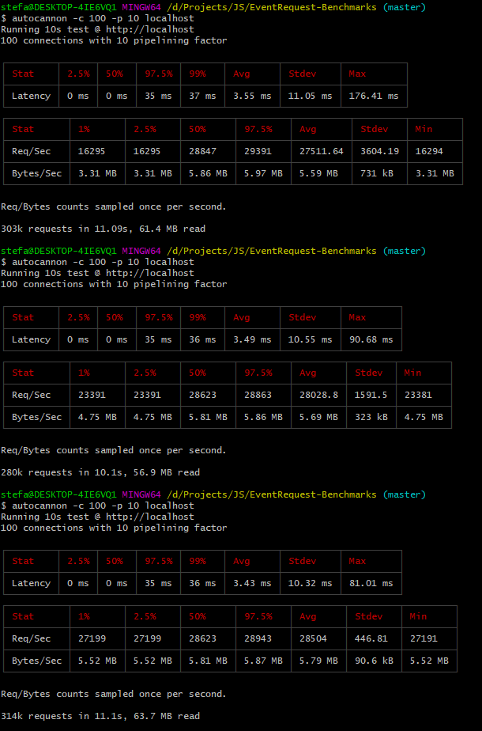
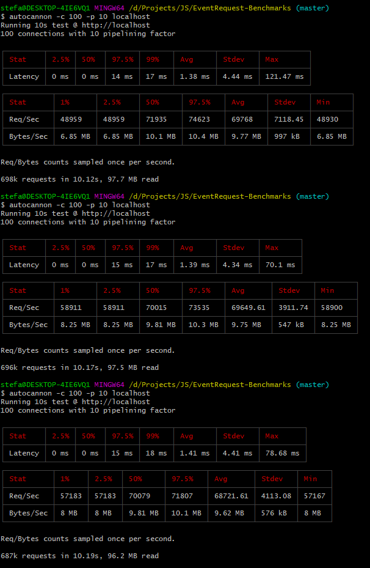
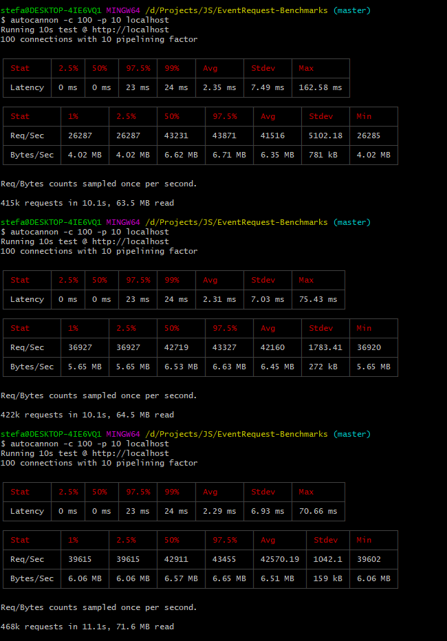
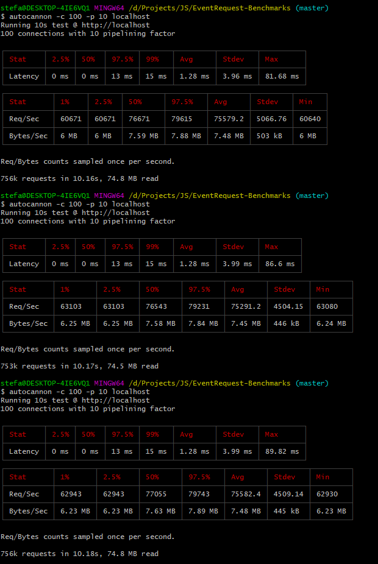
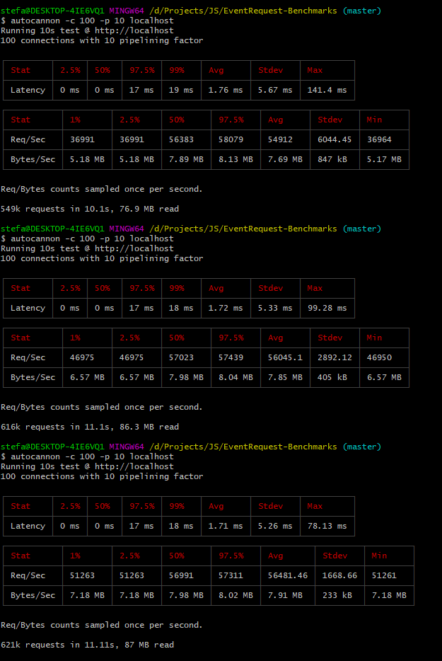
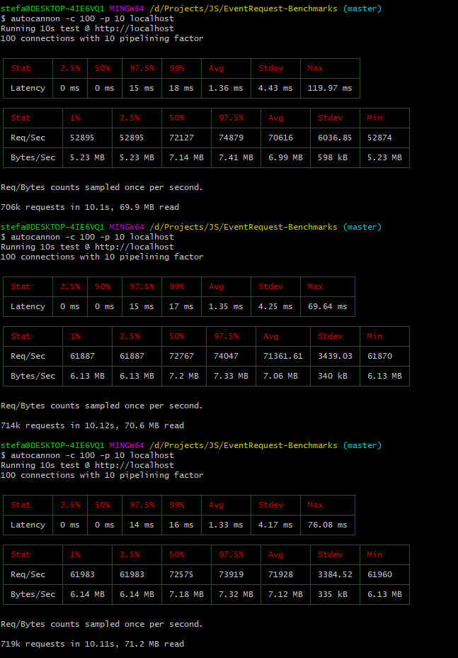
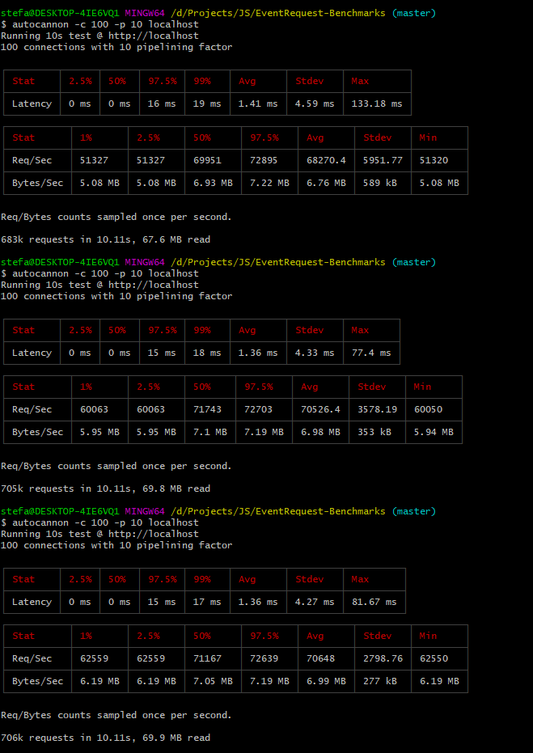

# EventRequest-Benchmarks
Benchmarks for EventRequest ( NOTE: THESE ARE FOR 29.4.0, 30.0.1 shows even better results than this, you can test for yourself )

The tests are performed with [**autocannon**](https://www.npmjs.com/package/autocannon).

Run any of the files ( either event_request, express or rayo ), open a new terminal and run `autocannon -c 100 -p 10 localhost`

Machine: i7-6700k || 16GB-DDR4-RAM || SSD

#Stress test with no processing:

#Event Request:

#Express:

#Fastify:

#Hapi:

#HTTP Server:

#Koa:

#Polka:

#Rayo:

